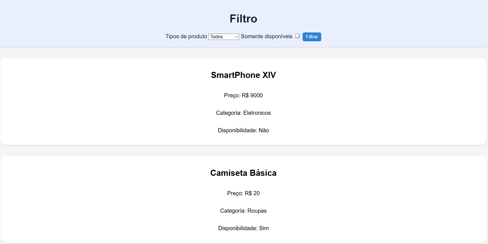
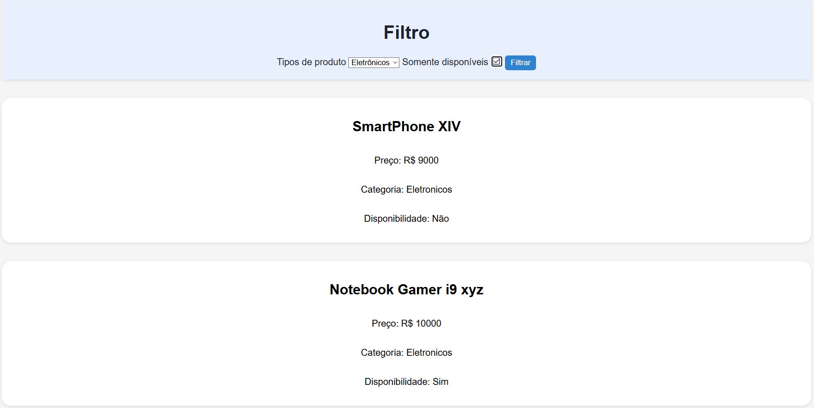
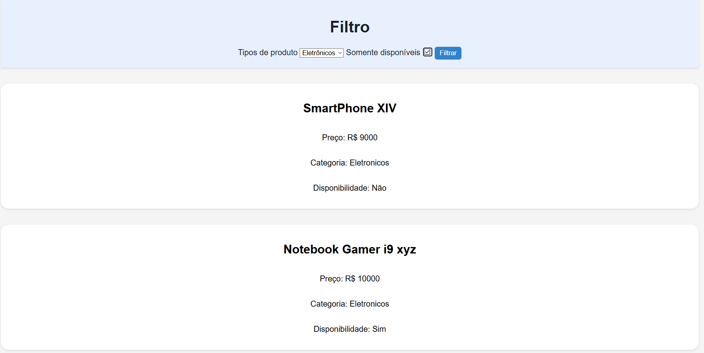

# 📋 Filtro de Produtos Interativo Cp Web Dev

[](#License) 

[](https://pedromarchese01.github.io/Cp3-web-dev/)

<div align="center">
  <!-- Carousel de Imagens -->
  
  
  
</div>

> Sistema de filtragem de produtos desenvolvido em **HTML5**, **CSS3** e **JavaScript** puro.

---

## 📝 Índice

1. [✨ Funcionalidades](#-funcionalidades)  
2. [🚀 Instalação Rápida](#-instalação-rápida)  
3. [⚙️ Como Usar](#️-como-usar)  
4. [💡 Personalização](#-personalização)  
5. [👥 Autores](#-autores)  
6. [🛡️ Licença](#️-licença)

---

## ✨ Funcionalidades

- 🎯 **Filtrar por Categoria:** Eletrônicos, Roupas e Alimentos.  
- ✅ **Somente Disponíveis:** Exibe apenas produtos em estoque.  
- 📱 **Design Responsivo:** Compatível com celulares, tablets e desktops.  
- 💫 **Animações Suaves:** Transições e hover effects estilizados.  
- 🔄 **Atualização Dinâmica:** Sem refresh de página.

---

## 🚀 Instalação Rápida

```bash
# Clone o repositório
git clone https://github.com/seu-usuario/filtro-produtos.git

# Entre na pasta do projeto
cd filtro-produtos

# Abra no navegador
abrir index.html
```
## ⚙️ Como Usar

1. No menu suspenso, escolha a **categoria** desejada.  
2. Marque a opção **"Somente Disponíveis"** se quiser ver apenas produtos em estoque.  
3. Clique em **Filtrar** para aplicar os filtros.  
4. Navegue pelos **cards** de produtos e explore o efeito **hover**.

### Código de Exemplo

```html
<!-- Dropdown de Categorias -->
<select id="categoria">
  <option value="todos">Todos</option>
  <option value="eletronicos">Eletrônicos</option>
  <option value="roupas">Roupas</option>
  <option value="alimentos">Alimentos</option>
</select>

<!-- Checkbox de Disponibilidade -->
<label>
  <input type="checkbox" id="disponivel" /> Somente Disponíveis
</label>

<!-- Botão de Filtrar -->
<button id="btn-filtrar">Filtrar</button>
```

## 💡 Personalização

- **Adicionar Novas Categorias:** Edite o array de produtos em `script.js` e inclua `categoria: 'sua-categoria'`, para que  filtro funcione adicione sua categoria no `select` do html e faça um outro else if com o mesmo modelo.  
- **Estilos Customizados:** Modifique `style.css` para alterar cores, fontes e espaçamentos.  


## 👥 Autores

| Nome           | RM                               | GitHub                                               |
| -------------- | -------------------------------- | ------------------------------------------           |
| Pedro Marchese | rm 563339                        | [@pedromarchese](https://github.com/PedroMarchese01) |
| Enzo Augusto   | rm                               | [@enzoaugusto](https://github.com/Enzoo-August)      |

